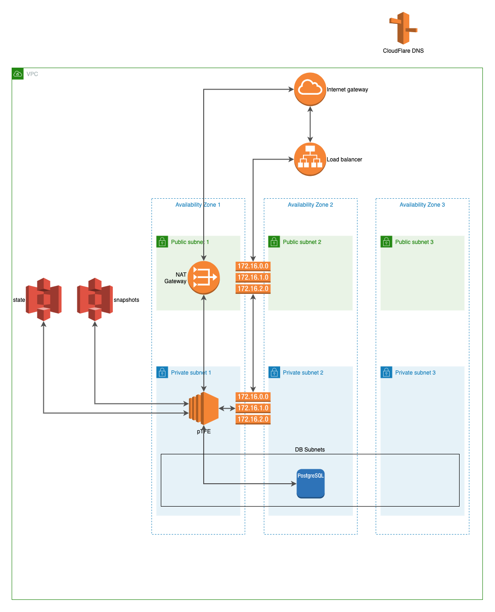
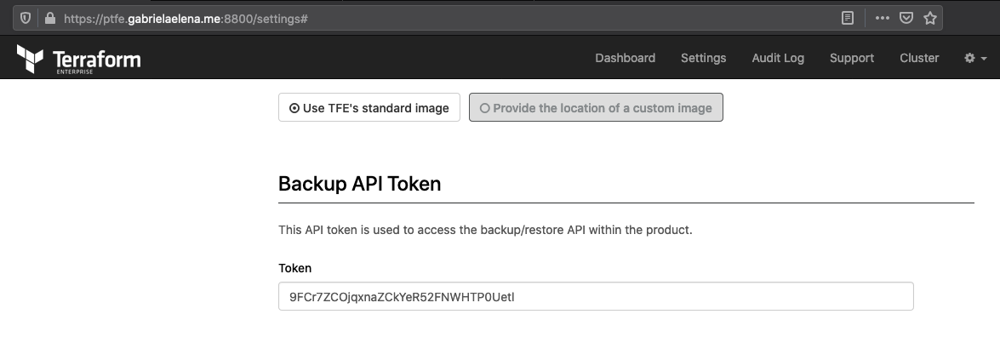

# Description
Modular terraform code which will deploy private TFE on AWS with external service mode

As external service TFE application will use S3 bucket for state file and snapshot as well as RDS(PostgreSQL)  for application configuration

The diagram for private Terraform would be the following:



# Pre-requirements
- [Terraform](https://www.terraform.io)
- [PTFE](https://www.terraform.io/docs/enterprise/index.html)
- License (provided by HashiCorp)
- Get Letsencrypt certificate (or any other valid)
- DNS [record](https://www.cloudflare.com/)
- [AWS](https://aws.amazon.com) account
  - we will use m5.large as [recommended](https://www.terraform.io/docs/enterprise/before-installing/reference-architecture/aws.html) type

# Terraform version
This module was written and tested with Terraform v0.12.20

# Assumptions
- You want to install private TFE using terraform code in external service mode
- You have access to AWS console where you can create you security credentials `AWS_ACCESS_KEY_ID` and `AWS_SECRET_ACCESS_KEY`
- You configured your security credentials as your environment variables `~/.bash_profile` 

```
export AWS_ACCESS_KEY_ID=XXXX
export AWS_SECRET_ACCESS_KEY=XXXX
export AWS_DEFAULT_REGION=XXXX
```

# How to consume

```bash
git clone git@github.com:andrewpopa/ptfe-aws-es.git
cd ptfe-aws-es
```

- [`main.tf`](https://github.com/andrewpopa/ptfe-aws-es/blob/master/main.tf) file has all the configuration

As the installation it's modular it consume it's dependencies from separate modules. When you'll use this dependencies, you'll have a list of inputs/outputs variables for each of module which need to be populated.

## Dependencies
- [vpc](https://github.com/andrewpopa/terraform-aws-vpc) - AWS VPC provisioning
- [security-group](github.com/andrewpopa/terraform-aws-security-group) - AWS security group provisioning
- [alb](https://github.com/andrewpopa/terraform-aws-alb) - AWL application load balancer provisioning
- [rds](https://github.com/andrewpopa/terraform-aws-rds) - AWS RDS(postgreSQL) instance provisioning
- [ptfe-es](https://github.com/andrewpopa/terraform-aws-s3) - AWS S3 bucket for state files
- [ptfe-es-snapshot](https://github.com/andrewpopa/terraform-aws-s3) - AWSS3 bucket for TFE snapshot
- [dns](https://github.com/andrewpopa/terraform-cloudflare-dns) - Cloudflare DNS management
- [key-pair](https://github.com/andrewpopa/terraform-aws-key-pair) - SSH key-pair for EC2 instance
- [ec2](https://github.com/andrewpopa/terraform-aws-ec2) - AWS EC2 instance 
- [silent](https://github.com/andrewpopa/ptfe-aws-es/tree/master/modules/silent) - silent module which does installation and also has logic in case of EC2 instance fail to restore the latest snapshot
- [iam-profile](https://github.com/andrewpopa/terraform-aws-iam-profile) - IAM instance profile to lunch with

Beyond the inputs variables for dependencies which need to be populated, silent module has input and output variables.

## Inputs
| **Name**  | **Type** | **Default** | **Required** | **Description** |
| ------------- | ------------- | ------------- | ------------- | ------------- |
| fqdn | string | module.dns.fqdn | yes | FQDN where you are deploying pTFE |
| dashboard_default_password | string |  | yes | Admin panel password |
| pg_dbname | string | module.rds.db_name | yes | RDS name |
| pg_netloc | string | module.rds.rds_ip | yes | RDS fqdn |
| pg_password | string | Password123# | yes | RDS password |
| pg_user | string | module.rds.db_username | yes | RDS user |
| s3_bucket_svc | string | module.ptfe-es.s3_bucket_id | yes | S3 bucket for state files |
| s3_region | string | module.ptfe-es.s3_bucket_region | yes | S3 region |
| s3_bucket_svc_snapshots | string | module.ptfe-es-snapshot.s3_bucket_id | yes | S3 bucket for snapshots |
| download_fullchain | string |  | yes | URL to download fullchain |
| download_private | string |  | yes | URL to download private key |
| download_license | string |  | yes | URL to download pTFE license file |

One all inputs variables are populated, you can proceed to run it

```hcl
$ terraform init
$ terraform apply
```

## Outputs
| **Name**  | **Type** | **Description** |
| ------------- | ------------- | ------------- |
| ec2_public_ip | string | EC2 public ip |
| ec2_public_dns | string | EC2 public dns |
| rds_hostname | string | Bucket region |
| s3_configuration | string | S3 for state files |
| fqdn | string | FQDN to access the service |
| ssh_key | string | SSH command to access the instance directly if it's public |

# Private/Public deployment

To not expose the service directly to the internet, service will be deployed behind application load balancer, however in case you want to deploy it in public subnet for any reason you can choose subnet 

```hcl
module "ec2" {
  source   = "github.com/andrewpopa/terraform-aws-ec2"
  ami_type = "ami-0085d4f8878cddc81"
  subnet_id              = module.vpc.public_subnets[0] # substitute with `private_subnets`
  vpc_security_group_ids = module.security-group.sg_id
  key_name               = module.key-pair.public_key_name
  public_key             = module.key-pair.public_key
  public_ip              = true
  user_data              = module.silent.silent_template
  instance_profile       = module.iam-profile.iam_instance_profile
  ec2_instance = {
    type          = "m5.large"
    root_hdd_size = 50
    root_hdd_type = "gp2"
  }

  ec2_tags = {
    ec2 = "my-ptfe-instance"
  }
}
```

# Backup

[Reference documentation](https://www.terraform.io/docs/enterprise/admin/backup-restore.html)

Under admin UI -> `Settings`

There is a Backup API Token which must be used to create and restore



`payload.json` for request

```json
{ "password": "Password123#" }
```

Create backup

```bash
curl \
  --header "Authorization: Bearer BACKUP-API-TOKEN" \
  --request POST \
  --data @payload.json \
  --output backup.blob \
  https://ptfe.gabrielaelena.me/_backup/api/v1/backup
```

Once you have your fresh new instance restored after failure.

Restore from backup

```bash
  curl \
  --header "Authorization: Bearer BACKUP-API-TOKEN" \
  --request POST \
  --form config=@payload.json \
  --form snapshot=@backup.blob \
  https://ptfe.gabrielaelena.me/_backup/api/v1/restore
```